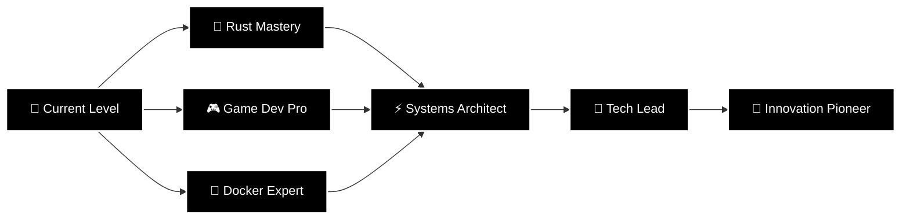

<div align="center">
  
</div>

<div align="center">
  
  <!-- Animated Typing Effect -->
  [](https://git.io/typing-svg)
  
  <!-- Snake Animation eating contributions -->
  <picture>
    <source media="(prefers-color-scheme: dark)" srcset="https://raw.githubusercontent.com/platane/snk/output/github-contribution-grid-snake-dark.svg">
    <source media="(prefers-color-scheme: light)" srcset="https://raw.githubusercontent.com/platane/snk/output/github-contribution-grid-snake.svg">
    
  </picture>

</div>

<br/>

<!-- Animated Divider -->


<div align="center">
  
  ## 📜 WISDOM FROM THE CULTIVATION WORLD
  
  
  
  ### *"The strong prey on the weak, it is the eternal law of the cultivation world."*
  
  ### *"To think backwards is to walk forwards."*
  
  ### *"Perseverance and wisdom create miracles."*
  
  ### *"A person's thought is very wondrous. A single thought can create heaven, and a single thought can create hell."*

  

</div>

<br/>

<!-- About Me Section -->
<div align="center">
  
  

</div>

<div align="center">
  <table>
    <tr>
      <td width="50%" align="center">
        
      </td>
      <td width="50%" align="center">
        
      </td>
    </tr>
  </table>
</div>

<div align="center">
  
  

</div>

<br/>

<!-- Profile Info -->


```yaml
name: Developer Chronicles
class: Software Craftsman
level: Forever Learning
location: The Digital Realm

current_quest:
  - 🦀 Mastering Rust for Systems Programming
  - 🐍 Python Automation & Scripting
  - 🎯 Flutter Cross-Platform Development
  - 🎮 Unreal Engine Game Development
  - 🐳 Learning Docker Containerization
  - 🐧 Arch Linux Power User (BTW I use Arch)

tools_of_trade:
  editors: [NeoVim, VSCode]
  terminal: [Alacritty, Kitty, Zsh]
  version_control: [Git, GitHub]
  automation: [n8n]
  backend: [Firebase, Supabase]
  
philosophy: "Never Giving Up Is My Magic"

favorite_activities:
  - ⛏️ Building in Minecraft
  - 📺 Watching Anime
  - 💻 Late Night Coding Sessions
  - 🎮 Game Development
  - 📚 Reading Cultivation Novels

status: "Open for Collaboration & Learning"
```

<br clear="all"/>

<!-- Animated Divider -->


<div align="center">
  
  ## 🗡️ WEAPONRY & CULTIVATION TECHNIQUES (TECH STACK)

</div>

<!-- Core Languages -->
<div align="center">
  
  ### ⚡ Core Languages
  
  
  
  
  
  
  
  
  
  
  
  
  
  

</div>

<!-- Game Development -->
<div align="center">
  
  ### 🎮 Game Development Arsenal
  
  
  
  

</div>

<!-- Mobile Development -->
<div align="center">
  
  ### 📱 Mobile Development
  
  
  

</div>

<!-- Backend & Database -->
<div align="center">
  
  ### 🗄️ Backend & Database
  
  
  
  
  
  
  

</div>

<!-- Operating System & Tools -->
<div align="center">
  
  ### 🐧 Operating System & DevOps
  
  
  
  
  
  
  

</div>

<!-- Animated Divider -->


<!-- GitHub Activity Graph -->
<div align="center">
  
  ## 📊 CULTIVATION PROGRESS (GITHUB ACTIVITY)
  
  

</div>

<!-- Language Stats -->
<div align="center">
  
  

</div>

<!-- Animated Divider -->


<!-- Detailed Skills Breakdown -->
<div align="center">
  
  ## 🎯 SKILL MASTERY LEVELS

</div>

```ascii
╔══════════════════════════════════════════════════════════════════╗
║                    🗡️  COMBAT PROFICIENCY  🗡️                   ║
╚══════════════════════════════════════════════════════════════════╝

┌─────────────────────────────────────────────────────────────────┐
│ Programming Languages                                            │
├─────────────────────────────────────────────────────────────────┤
│ Python          ████████████████████░░  90%  [Master]           │
│ Rust            █████████████████░░░░░  80%  [Advanced]         │
│ JavaScript      ███████████████░░░░░░░  75%  [Proficient]       │
│ TypeScript      ████████████░░░░░░░░░░  60%  [Intermediate]     │
│ Flutter/Dart    ███████████████████░░░  85%  [Advanced]         │
│ Lua             ████████████░░░░░░░░░░  55%  [Intermediate]     │
│ Java            ██████████░░░░░░░░░░░░  50%  [College Level]    │
│ C++             ████████░░░░░░░░░░░░░░  40%  [Basic]            │
└─────────────────────────────────────────────────────────────────┘

┌─────────────────────────────────────────────────────────────────┐
│ Game Development                                                 │
├─────────────────────────────────────────────────────────────────┤
│ Unreal Engine   ████████████████░░░░░░  80%  [Blueprints]       │
│ Unreal C++      ████████░░░░░░░░░░░░░░  40%  [Learning]         │
│ Game Design     ██████████████░░░░░░░░  70%  [Growing]          │
└─────────────────────────────────────────────────────────────────┘

┌─────────────────────────────────────────────────────────────────┐
│ Tools & Platforms                                                │
├─────────────────────────────────────────────────────────────────┤
│ Arch Linux      ███████████████████░░░  95%  [Power User]       │
│ Git/GitHub      ████████████████████░░  90%  [Advanced]         │
│ Firebase        ███████████████░░░░░░░  75%  [Proficient]       │
│ Supabase        ███████████████░░░░░░░  75%  [Proficient]       │
│ Docker          ████████░░░░░░░░░░░░░░  40%  [Learning]         │
│ n8n Automation  ██████████████░░░░░░░░  70%  [Intermediate]     │
└─────────────────────────────────────────────────────────────────┘

╔══════════════════════════════════════════════════════════════════╗
║            🔥 Total XP Earned: Level 42 Developer 🔥             ║
╚══════════════════════════════════════════════════════════════════╝
```

<!-- Animated Divider -->


<!-- Contribution Graph -->
<div align="center">
  
  ## 🌌 CONTRIBUTION CONSTELLATION

  

</div>

<!-- Animated Divider -->


<!-- More Reverend Insanity Quotes -->
<div align="center">

  ## 💎 MORE WISDOM FROM REVEREND INSANITY

  <table>
    <tr>
      <td width="50%">
        
      </td>
      <td width="50%">
        <br/>
        <blockquote>
          <p><i>"In this world, there is no absolute good or evil. The strong make the rules, while the weak follow them."</i></p>
        </blockquote>
        <br/>
        <blockquote>
          <p><i>"Wisdom is the greatest treasure; it illuminates the darkest paths."</i></p>
        </blockquote>
        <br/>
        <blockquote>
          <p><i>"Every failure is a lesson, every setback is a step forward for those who refuse to give up."</i></p>
        </blockquote>
      </td>
    </tr>
  </table>

</div>

<!-- Animated Divider -->


<!-- Minecraft ASCII Art -->
```ascii
╔════════════════════════════════════════════════════════════════════╗
║                                                                    ║
║   ███╗   ███╗██╗███╗   ██╗███████╗ ██████╗██████╗  █████╗ ███████╗
║   ████╗ ████║██║████╗  ██║██╔════╝██╔════╝██╔══██╗██╔══██╗██╔════╝
║   ██╔████╔██║██║██╔██╗ ██║█████╗  ██║     ██████╔╝███████║█████╗  
║   ██║╚██╔╝██║██║██║╚██╗██║██╔══╝  ██║     ██╔══██╗██╔══██║██╔══╝  
║   ██║ ╚═╝ ██║██║██║ ╚████║███████╗╚██████╗██║  ██║██║  ██║██║     
║   ╚═╝     ╚═╝╚═╝╚═╝  ╚═══╝╚══════╝ ╚═════╝╚═╝  ╚═╝╚═╝  ╚═╝╚═╝     
║                                                                    ║
║              🎮 Building The Future, Block by Block 🎮            ║
╚════════════════════════════════════════════════════════════════════╝

    ⛏️  [Mining Resources]    🔨  [Crafting Solutions]    
    🏗️  [Building Projects]   ⚔️  [Fighting Bugs]
    🧭  [Exploring New Tech]  💎  [Finding Treasures]
```

<!-- Animated Divider -->


<!-- Projects Showcase -->
<div align="center">
  
  ## 🏆 LEGENDARY ARTIFACTS (FEATURED PROJECTS)

</div>

<div align="center">
  <table>
    <tr>
      <td width="50%" valign="top">
        <div align="center">
          <h3>🎯 Simple Quiz Website</h3>
          
          <br/><br/>
          
          
          
          <br/><br/>
          <p align="left">⚡ Interactive quiz application with dynamic question loading, timer functionality, and instant score feedback. A perfect blend of UI/UX design and JavaScript logic.</p>
        </div>
      </td>
      <td width="50%" valign="top">
        <div align="center">
          <h3>📚 KKNotesV2</h3>
          
          <br/><br/>
          
          
          <br/><br/>
          <p align="left">🎓 Comprehensive study resource platform for students with organized notes, videos, and downloadable materials. Built with React for seamless navigation.</p>
        </div>
      </td>
    </tr>
    <tr>
      <td width="50%" valign="top">
        <div align="center">
          <h3>📱 Hexinox-MakeIT</h3>
          
          <br/><br/>
          
          
          <br/><br/>
          <p align="left">🚀 Mobile application with intuitive UI and cross-platform compatibility. Demonstrates advanced Flutter development skills and modern mobile design patterns.</p>
        </div>
      </td>
      <td width="50%" valign="top">
        <div align="center">
          <h3>💰 Expense Tracker</h3>
          
          <br/><br/>
          
          <br/><br/>
          <p align="left">💻 Command-line expense management tool with file-based storage, category tracking, and reporting features. Low-level programming meets practical utility.</p>
        </div>
      </td>
    </tr>
  </table>
</div>

<!-- Animated Divider -->


<!-- Current Projects -->
<div align="center">
  
  ## 🔥 CURRENT CULTIVATION FOCUS

</div>

<table width="100%">
  <tr>
    <td width="50%">
      <h3>🦀 Rust Systems Programming</h3>
      <p>Diving deep into memory-safe systems programming with Rust. Building high-performance tools and exploring WebAssembly integration.</p>
      
    </td>
    <td width="50%">
      <h3>🎮 Unreal Engine Mastery</h3>
      <p>Creating immersive game experiences using Unreal Engine's Blueprint system and diving into C++ for advanced game mechanics.</p>
      
    </td>
  </tr>
  <tr>
    <td width="50%">
      <h3>🐳 Docker Containerization</h3>
      <p>Learning to containerize applications for better deployment and scalability. Exploring Docker Compose and orchestration.</p>
      
    </td>
    <td width="50%">
      <h3>📱 Flutter Excellence</h3>
      <p>Building beautiful, natively compiled applications for mobile from a single codebase. Mastering state management and animations.</p>
      
    </td>
  </tr>
</table>

<!-- Animated Divider -->


<!-- Anime Section -->
<div align="center">
  
  ## 🎌 ANIME SPIRIT
  
  
  
  ### *Favorite Genres*
  
  🔥 Action • ⚔️ Fantasy • 🧠 Psychological • 🌍 Isekai • 🎭 Drama
  
  <br/>
  
  ### *Currently Watching & Reading*
  
  📖 Reverend Insanity (Novel) - *"The path of cultivation is endless"*
  
  <br/>
  
  

</div>

<!-- Animated Divider -->


<!-- Minecraft Section -->
<div align="center">
  
  ## ⛏️ MINECRAFT BUILDER'S LOG
  
  
  
  ```diff
  + ⚒️ Building massive redstone contraptions
  + 🏰 Creating epic medieval castles
  + 🔴 Automating farms with redstone circuits
  + 💎 Mining for those precious diamonds
  + 🎨 Pixel art of favorite anime characters
  + 🌋 Exploring the Nether for netherite
  ```
  
  ### *"In Minecraft, as in code, you build one block at a time"*

</div>

<!-- Animated Divider -->


<!-- GitHub Metrics -->
<div align="center">
  
  ## 📈 DETAILED CULTIVATION METRICS

  

  <table>
    <tr>
      <td width="50%">
        
      </td>
      <td width="50%">
        
      </td>
    </tr>
    <tr>
      <td width="50%">
        
      </td>
      <td width="50%">
        
      </td>
    </tr>
  </table>

</div>

<!-- Animated Divider -->


<!-- Learning Path -->
<div align="center">
  
  ## 🛤️ THE CULTIVATION PATH AHEAD

</div>



<!-- Animated Divider -->


<!-- Development Setup -->
<div align="center">
  
  ## 🖥️ MY BATTLE STATION

</div>

```yaml
╔═══════════════════════════════════════════════════════════╗
║                    ⚔️ DEV ENVIRONMENT ⚔️                 ║
╠═══════════════════════════════════════════════════════════╣
║                                                           ║
║  Operating System:  🐧 Arch Linux (BTW)                  ║
║  Terminal:          ⚡ Alacritty + Zsh + Oh-My-Zsh       ║
║  Shell Theme:       🎨 Powerlevel10k                      ║
║  Editor:            📝 Neovim (with NvChad config)       ║
║  IDE:               💻 VSCode (for complex projects)     ║
║  Version Control:   🌿 Git + GitHub CLI                  ║
║  Container:         🐳 Docker (Learning)                 ║
║  Database Tools:    🔥 Firebase + Supabase               ║
║  API Testing:       📮 Postman + HTTPie                  ║
║  Automation:        🤖 n8n                               ║
║                                                           ║
║  Font:              🔤 JetBrains Mono Nerd Font          ║
║  Color Scheme:      🎨 Tokyo Night / Gruvbox             ║
║  File Manager:      📁 Ranger / LF                       ║
║  System Monitor:    📊 htop + btop                       ║
║                                                           ║
╚═══════════════════════════════════════════════════════════╝
```

<!-- Animated Divider -->


<!-- Coding Stats -->
<div align="center">
  
  ## ⏰ CODING TIMELINE

  <!--START_SECTION:waka-->
  ```text
  🌙 Late Night Coding Sessions Preferred
  ☕ Powered by Coffee and Determination
  🎧 Always with Anime OSTs Playing
  ```
  <!--END_SECTION:waka-->

</div>

<!-- Animated Divider -->
8506553ee.gif" width="100%">

<!-- Random Dev Quote -->
<div align="center">
  
  ## 💭 DEVELOPER WISDOM OF THE DAY

  

</div>

<!-- Animated Divider -->


<!-- Achievements -->
<div align="center">
  
  ## 🏅 ACHIEVEMENT UNLOCKED

</div>

<div align="center">
  <table>
    <tr>
      <td align="center" width="25%">
        
        <br/><b>Code Warrior</b>
        <br/><sub>1000+ Commits</sub>
      </td>
      <td align="center" width="25%">
        
        <br/><b>Arch Master</b>
        <br/><sub>BTW I Use Arch</sub>
      </td>
      <td align="center" width="25%">
        
        <br/><b>Open Source</b>
        <br/><sub>Contributing Daily</sub>
      </td>
      <td align="center" width="25%">
        
        <br/><b>Night Owl</b>
        <br/><sub>Coding at 3 AM</sub>
      </td>
    </tr>
  </table>
</div>

<!-- Animated Divider -->


<!-- Connect Section -->
<div align="center">
  
  ## 🌐 CONNECT WITH THIS CULTIVATOR

   
  
  ### *"In the world of code, connections forge the strongest foundations"*

  <br/>

  <a href="https://github.com/ChristopherJoshy">
    
  </a>
  <a href="https://linkedin.com/in/christopher-joshy">
    
  </a>
  
  <br/><br/>
  
  

</div>

<!-- Animated Divider -->


<!-- Snake Game -->
<div align="center">
  
  ## 🐍 CONTRIBUTION SNAKE ANIMATION
  
  <picture>
    <source media="(prefers-color-scheme: dark)" srcset="https://raw.githubusercontent.com/platane/platane/output/github-contribution-grid-snake-dark.svg">
    <source media="(prefers-color-scheme: light)" srcset="https://raw.githubusercontent.com/platane/platane/output/github-contribution-grid-snake.svg">
    
  </picture>

</div>

<!-- Animated Divider -->


<!-- Final Quote -->
<div align="center">
  
  

  <br/><br/>

  ```ascii
  ╔═══════════════════════════════════════════════════════════════╗
  ║                                                               ║
  ║     "In this world, strength is everything.                  ║
  ║      But true strength comes from never giving up."          ║
  ║                                                               ║
  ║              - A Cultivator's Journey -                      ║
  ║                                                               ║
  ╚═══════════════════════════════════════════════════════════════╝
  ```

  <br/>

  ### 🌟 *May Your Code Compile, Your Builds Succeed, and Your Bugs Be Few* 🌟

  <br/>

  

</div>

<!-- Animated Divider -->


<!-- Footer -->
<div align="center">
  
  

</div>

---

<div align="center">
  
  ⭐️ **If you like what you see, feel free to star some repositories!** ⭐️
  
  <sub>Built with 🖤 by Christopher Joshy | Powered by Coffee ☕ & Determination 🔥</sub>
  
  <br/><br/>
  
  

</div>
